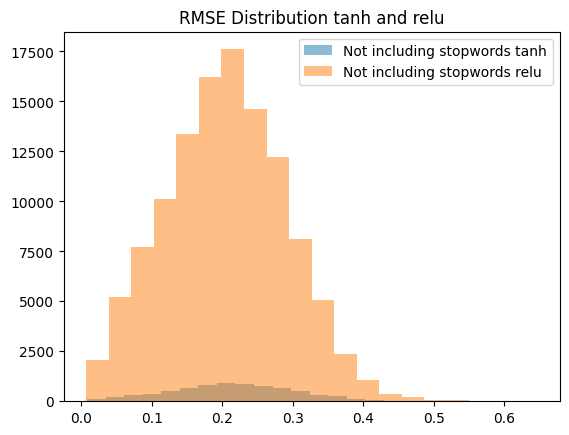
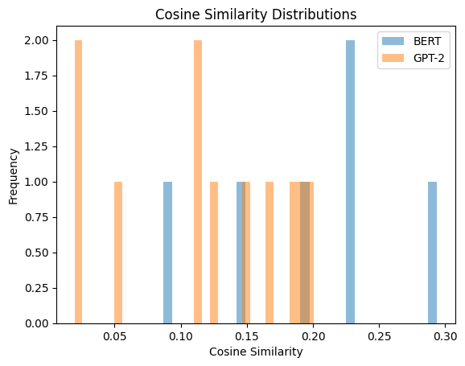
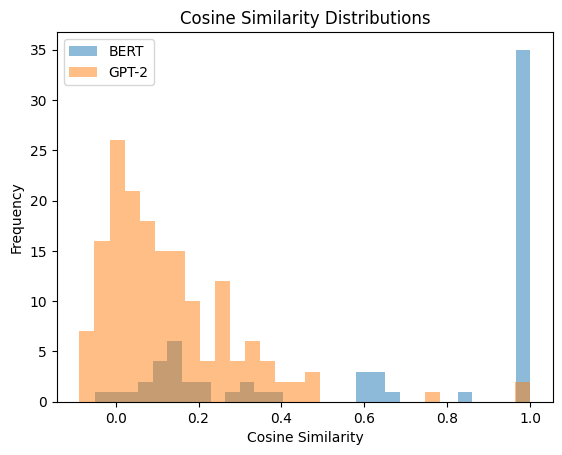
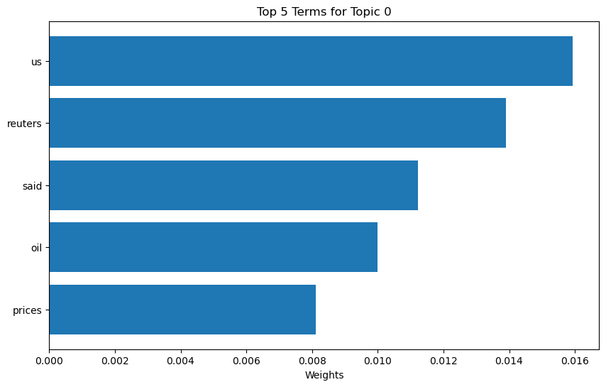
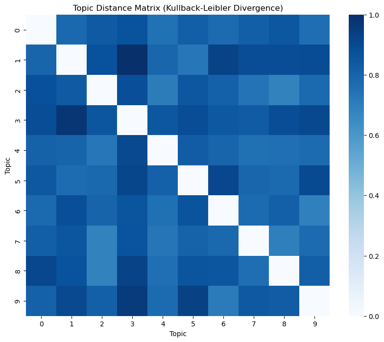
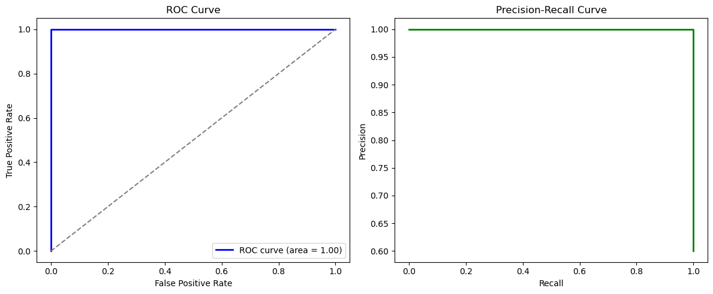
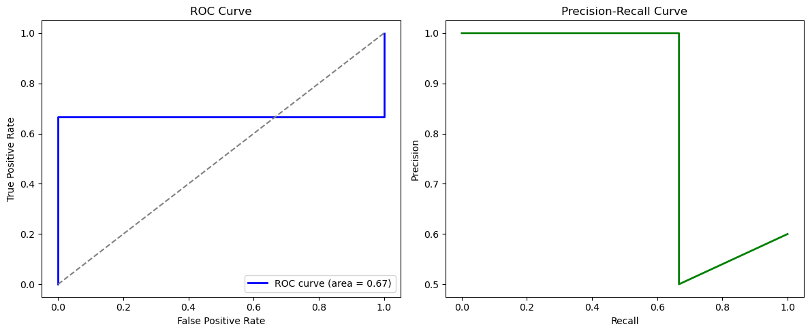

Question1

Not including Stopword
Mean RMSE (tanh): 0.22068321704864502, Mean RMSE (ReLU): 0.2502865493297577
Std RMSE (tanh): 0.08645288646221161, Std RMSE (ReLU): 0.08630675822496414

Not including Stopword
Std RMSE (tanh): 0.08653884381055832, Std RMSE (ReLU): 0.08530408889055252
Mean RMSE (tanh): 0.21537311375141144, Mean RMSE (ReLU): 0.20502625405788422

### **Compare include stopwords or not**

Mean RMSE (relu) not: 0.20502625405788422, Mean RMSE (relu): 0.2055266946554184
Std RMSE (relu) not: 0.08530408889055252, Std RMSE (relu): 0.0843384861946106

The distribution is narrower but shifted slightly towards higher RMSE values, reflecting the slightly worse average performance when stop words are included.
Overall, the overlap in the histograms indicates minimal impact of stop words on the model's performance, with a slight preference for excluding stop words.

### **Compare tanh and Relu**

Mean RMSE (relu) not: 0.20502625405788422, Mean RMSE (relu): 0.2055266946554184
Std RMSE (relu) not: 0.08530408889055252, Std RMSE (relu): 0.0843384861946106

Use tanh if you prioritize model stability and lower RMSE variance.
Use relu if your task involves more complex patterns and you need better scalability and computational efficiency.
RMSE more lower might indicate that more accurate result.

Based on the above image, we might choose tanh for better result.

### **Predict last two words**
Last five words : unseen astronom first hour day
Input : unseen astronom first
Predict result(tanh_model_not_including_stopwords model) : ['side', 'greec']
Probability : 
[('side', 0.9954066872596741), ('greec', 0.9953985810279846), ('saw', 0.9953650832176208)]
[('greec', 0.9953914880752563), ('releas', 0.9953892827033997), ('side', 0.9953795671463013)]

---

### **Conclusion**
Given the lower mean RMSE and comparable stability, **tanh** is the better choice of activation function for this dataset and task. It minimizes prediction errors while maintaining consistent performance..

---

### **Question2**

### **Data without puntuation**

In the situation, the data with punctuation
BERT Accuracy: 0
GPT-2 Accuracy: 0

the first three sets of data：
predictions_bert = ['.', '.', '.']
predictions_gpt2 = ['space', 'proteins', 'be']
actual_words = ['rocket.', 'proteins.', 'bring.']

In the situation, the data without punctuation
BERT Accuracy: 0.0046058691933149095
GPT-2 Accuracy: 0.23042505592841164

the first three sets of data：
predictions_bert = ['.', '.', '.']
predictions_gpt2 = ['space', 'proteins', 'be']
actual_words = ['rocket', 'proteins', 'bring']

GPT-2 perform more better!

---

### **First Image: Cosine Similarity Distributions with punctuation (BERT vs GPT-2)**

### **Second Image: Cosine Similarity Distributions without punctuation (BERT vs GPT-2)**

---

### **Question3**

Top 5 terms:

Topic Distance:

---
### **Question4**

Data:

url_list = [
    "https://en.wikipedia.org/wiki/Tesla,_Inc.",
    "https://en.wikipedia.org/wiki/Battery_electric_vehicle",
    "https://en.wikipedia.org/wiki/Elon_Musk",
    "https://en.wikipedia.org/wiki/Tesla_Model_S",
    "https://en.wikipedia.org/wiki/Energy_storage",
    "https://en.wikipedia.org/wiki/Tesla_Automation",
    "https://en.wikipedia.org/wiki/Main_Page",
    "https://en.wikipedia.org/w/index.php?title=Special:CreateAccount&returnto=Main+Page",
    "https://donate.wikimedia.org/w/index.php?title=Special:LandingPage&country=US&uselang=en&wmf_medium=sidebar&wmf_source=donate&wmf_campaign=C13_en.wikipedia.org",
    "https://en.wikipedia.org/wiki/Help:Contents",
    "https://wikimediafoundation.org"
]

In the above url_list, I mostly choose wiki website that is related to Tesla.

Labels show in below:
labels = {1: 1, 2: 1, 3: 1, 4: 1, 5: 1, 6: 1, 7: 0, 8: 0, 9: 0, 10: 0, 11: 0}

## Case1 : using pre-defined relevant words
When calculating TF-IDF, I use pre-defined words as relevant words.

['tesla', 'electric', 'vehicle', 'elon', 'musk', 'battery']

Training Accuracy 1.0
Testing Accuracy:  0.8

Training Result:
Train Precision :  1.0
Train Recall 1.0
Train F1 1.0

Testing Result:
Testing Precision 1.0
Testing Recall 0.6666666666666666
Testing F1 Score 0.8

## Case2 : using automated defined relevant words
When calculating TF-IDF, I do not use pre-defined words as relevant words.

vectorizer = TfidfVectorizer(max_features=100, stop_words='english')

This way limits the number of features (unique words) to the top 100 most important ones based on TF-IDF scores. This ensures that only the most relevant words are kept, improving computational efficiency and reducing noise.

Training Accuracy 1.0
Testing Accuracy:  0.6

Training Result:
Train Precision :  1.0
Train Recall 1.0
Train F1 1.0

Testing Result:
Testing Precision 0.6
Testing Recall 1.0
Testing F1 Score 0.7499999999999999

