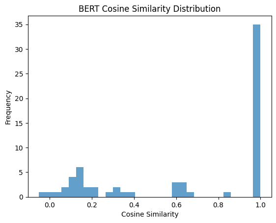

Question1

Not including Stopword
Mean RMSE (tanh): 0.22068321704864502, Mean RMSE (ReLU): 0.2502865493297577
Std RMSE (tanh): 0.08645288646221161, Std RMSE (ReLU): 0.08630675822496414

Based on the given results, here’s the analysis:

---

### **1. Mean RMSE**
- The mean RMSE for **tanh** is **0.2207**, which is significantly lower than the **0.2503** of **ReLU**.
- A lower RMSE indicates smaller prediction errors, meaning **tanh** outperforms **ReLU** in this regard.

---

### **2. Standard Deviation (Std RMSE)**
- The standard deviation of RMSE for **tanh** is **0.0865**, while for **ReLU** it is **0.0863**.
- Both activation functions demonstrate almost identical stability, as the difference in standard deviation is negligible.

---

### **3. Overall Analysis**
- **tanh** exhibits better performance in terms of lower prediction errors (mean RMSE) while maintaining similar stability (standard deviation) compared to **ReLU**.
- While **ReLU** remains competitive in stability, its higher RMSE makes it less preferable in this case.

---

### **Conclusion**
Given the lower mean RMSE and comparable stability, **tanh** is the better choice of activation function for this dataset and task. It minimizes prediction errors while maintaining consistent performance, making it more suitable for further experimentation or application.

### **Question2**

### **Data without puntuation**

In the situation, the data without punctuation
BERT Accuracy: 0.0046058691933149095
GPT-2 Accuracy: 0.23042505592841164

GPT-2 perform more better!
BERT Cosine Similarity Distribution without punctuation
---

### **First Image: BERT Cosine Similarity Distribution**

- **Description**: 
  - This image shows the cosine similarity distribution for the BERT model in without punctuation situation.
  - Most cosine similarity values are clustered around 1.0, indicating that BERT predicts many pairs of word embeddings with very high similarity.
  - A smaller portion of values is spread across the range of 0.0 to 0.6.
- **Analysis**: 
  - The distribution might suggest that BERT's similarity scores are highly concentrated, possibly reflecting overconfidence in certain embeddings.
  - The high concentration around 1.0 could indicate that BERT struggles to capture fine-grained distinctions in some cases.

---

### **Second Image: GPT-2 Cosine Similarity Distribution**
- **Description**: 
  - This image shows the cosine similarity distribution for the GPT-2 model in without punctuation situation.
  - The distribution is more spread out, with most values  within the range of 0.0 to 0.4.
  - There are only a few instances with high similarity values in the 0.8 to 1.0 range.
- **Analysis**: 
  - GPT-2's more distributed similarity scores might suggest that it captures a wider variety of semantic relationships between word embeddings.
  - Compared to BERT, GPT-2 appears more sensitive to semantic variations, with less frequent high-confidence predictions.

---

### **Third Image: Cosine Similarity Distributions (BERT vs GPT-2)**
- **Description**: 
  - This image compares the cosine similarity distributions of BERT (blue) and GPT-2 (orange).
  - BERT’s similarities are heavily concentrated around 1.0, while GPT-2’s distribution is broader, mostly concentrated in the 0.0 to 0.4 range.
- **Analysis**: 
  - BERT’s results indicate a focus on high semantic consistency for certain samples, likely influenced by its pretraining objectives that emphasize relationships within sentences.
  - GPT-2 demonstrates more diversity in its similarity distribution, reflecting a sensitivity to semantic and contextual differences across samples.
  - Based on the image, BERT appears overly optimistic about the similarity of certain embeddings, whereas GPT-2’s results might be better suited for tasks requiring nuanced semantic distinctions.

---

### **Summary**
1. **BERT Characteristics**:
   - Cosine similarity is highly concentrated, especially around 1.0, indicating strong semantic consistency but potentially a lack of sensitivity to finer semantic variations.
   - BERT is well-suited for tasks requiring strong intra-sentence coherence.

2. **GPT-2 Characteristics**:
   - A more evenly distributed similarity range suggests that GPT-2 captures a broader semantic diversity.
   - This makes GPT-2 more appropriate for tasks that require sensitivity to contextual variations or nuanced semantic relationships.

3. **Comparison**:
   - For tasks requiring consistent semantic representation (e.g., text classification), BERT may be more effective.
   - For tasks involving contextual diversity or ambiguity (e.g., text generation), GPT-2’s broader distribution makes it a better choice.